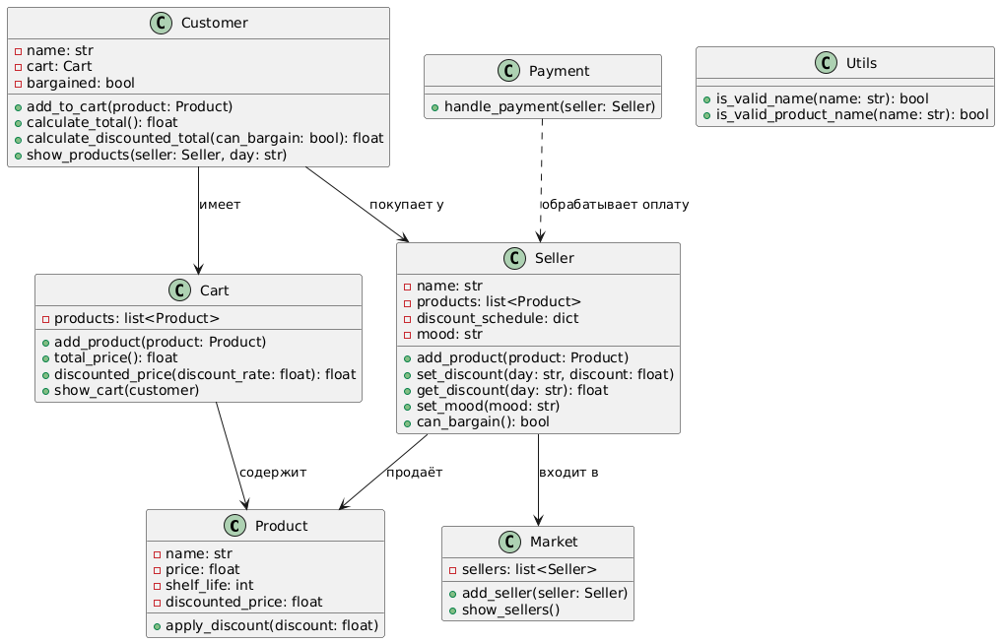
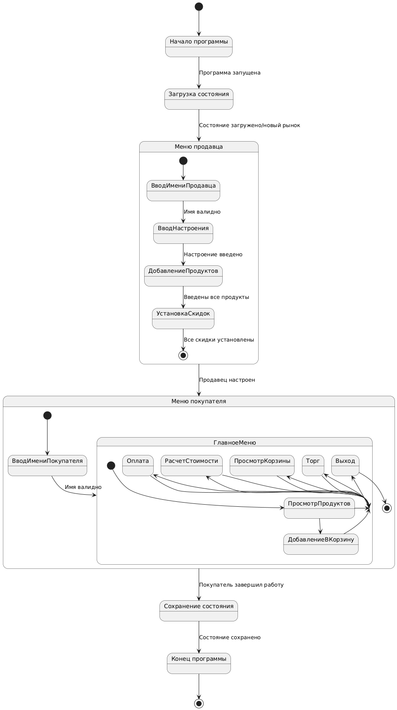

# Лабораторная работа №1
## Курс: "Проектирование программного обеспечения интеллектуальных систем"

### 🎯 Цель работы:
- Изучить основные возможности языка Python для разработки программных систем с интерфейсом командной строки (CLI).
- Разработать программную систему на языке Python согласно описанию предметной области.

## Вариант 9

### 📌 Предметная область
Функционирование рынка, взаимодействие покупателей и продавцов.

### Важные сущности
- Продуктовый рынок
- Покупатель
- Продавец
- Продукты
- Цены
- Акции
- Корзина покупок
---

## 🛠️ Описание классов и их методов

### 📦 Класс `Cart`
Корзина покупателя, включает методы:
- `add_product(product)`: добавить продукт в корзину.
- `total_price()`: вычислить общую стоимость товаров.
- `discounted_price(discount_rate)`: вычислить стоимость с учётом скидки.
- `show_cart(customer)`: вывести содержимое корзины.

### 🛒 Класс `Customer`
Покупатель, включает:
- `add_to_cart(product)`: добавить товар в корзину.
- `calculate_total()`: рассчитать стоимость без скидки.
- `calculate_discounted_total(can_bargain)`: учесть возможность торга.
- `show_products(seller, day)`: показать товары продавца на определённый день.

### 💰 Класс `Payment`
- `handle_payment(seller)`: обработка оплаты покупки у продавца.

### 🏪 Класс `Product`
Товар, содержит:
- `name`: название.
- `price`: цена.
- `shelf_life`: срок годности.
- `apply_discount(discount)`: применение скидки.

### 🏷️ Класс `Seller`
Продавец, включает:
- `add_product(product)`: добавить товар.
- `set_discount(day, discount)`: установить скидку на день недели.
- `can_bargain()`: определяет, готов ли продавец торговаться.

### 🏬 Класс `Market`
Рынок, включает:
- `add_seller(seller)`: добавить продавца.
- `save(filename)`: сохранить состояние.
- `load(filename)`: загрузить состояние.

---

## 🔥 Главное меню
Программа запускается через `main.py`, где реализован интерфейс CLI для взаимодействия с пользователем:
1. Меню продавца (реализовано в seller_menu.py):
   Пользователь вводит имя продавца и устанавливает настроение.
   Продавец добавляет продукты, указывая их цену и срок годности.
   Устанавливаются скидки на продукты по дням недели.
2. Меню покупателя (реализовано в customer_menu.py):
   Пользователь вводит имя покупателя.
   Покупатель может просмотреть доступные продукты и скидки.
   Добавление продуктов в корзину.
   Рассчет общей стоимости с учетом скидок и возможность торговаться с продавцом.
   Оплата покупок.
3. Загрузка и сохранение состояния:
   При старте программы пользователь может загрузить состояние рынка с предыдущего запуска.
   После завершения работы программа автоматически сохраняет текущее состояние рынка.

---

## 🧪 Тестирование
Написаны **unit-тесты** с использованием `unittest`. 
Покрываются:
- Создание товаров (`TestProduct`).
- Добавление продуктов в корзину (`TestCart`).
- Функции продавца (`TestSeller`).
- Покупатель и расчёты (`TestCustomer`).

---

## 📊Диаграммы

---

### 📚Диаграмма классов

### 🔄Диаграмма состояний

---

## 📌 Выводы
Работа позволила:

✅ Освоить **основы Python** для CLI.
✅ Реализовать **модульную архитектуру** программы.
✅ Использовать **сохранение и загрузку данных**.
✅ Написать **unit-тесты** для проверки работы системы.

🚀 **Готово к дальнейшему расширению и доработке!**

