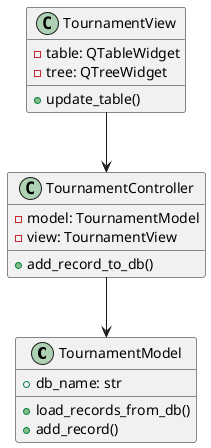

# 🏆 Лабораторная работа №2: Менеджер турниров

## 📌 Цель работы
- Изучить принципы построения GUI на Python 🐍
- Разработать приложение с главным окном и диалогами 🖼️
- Реализовать систему управления турнирами 🏅

## 🛠 Технологии
- **Python 3.10+**
- **PyQt6** для графического интерфейса
- **SQLite** для хранения данных
- **MVC-паттерн** (Model-View-Controller)

## 📋 Функционал приложения

### Основные возможности:
- 🏷️ Добавление записей о турнирах
- 🔍 Поиск по 3 типам критериев
- 🗑️ Удаление записей
- 📊 Два вида отображения (таблица/дерево)

### Поля записи:
1. Название турнира
2. Дата проведения
3. Вид спорта (футбол, теннис и др.)
4. ФИО победителя
5. Призовой фонд ($)
6. Заработок победителя (60% от призовых)

## 🖼️ Интерфейс

### Главное окно
```python
class TournamentView(QMainWindow):
    def __init__(self, controller):
        super().__init__()
        self.setWindowTitle("Менеджер турниров")
        self.setGeometry(100, 100, 1000, 700)
```

**Элементы:**
- 📋 Таблица с записями
- 🌳 Дерево с детализацией
- 📌 Панель инструментов:
  - ➕ Добавить
  - 🔍 Поиск/Удаление
  - 🔄 Обновить
  - ↔️ Переключить вид

### Диалоговые окна

#### 1. Добавление записи
```python
class AddRecordDialog(QDialog):
    def __init__(self, parent=None):
        super().__init__(parent)
        self.setWindowTitle("Добавить запись")
        self.setFixedSize(400, 350)
```
**Особенности:**
- 💰 Авторасчет заработка (60%)
- ✅ Валидация ввода
- 📅 Выбор даты из календаря

#### 2. Поиск/Удаление
```python
class SearchDeleteDialog(QDialog):
    def __init__(self, sports_list, is_delete_mode=False):
        super().__init__()
        self.setWindowTitle("Удаление записей" if is_delete_mode else "Поиск записей")
```
**Типы поиска:**
- 🏷️📅 По названию/дате
- 🎾👤 По виду спорта/победителю
- 💵 По призовому фонду/заработку

## 🏗️ Архитектура

### Модель (Model)
```python
class TournamentModel:
    """Работа с базой данных SQLite"""
    def __init__(self):
        self.db_name = "tournaments.db"
```
**Методы:**
- `load_records_from_db()` - загрузка данных
- `add_record()` - добавление новой записи
- `search_records()` - поиск по условиям

### Контроллер (Controller)
```python
class TournamentController:
    """Посредник между Model и View"""
    def __init__(self):
        self.model = TournamentModel()
        self.view = TournamentView(self)
```

### Представление (View)
```python
class TournamentView(QMainWindow):
    """Графический интерфейс"""
    def update_table(self, records):
        """Обновление таблицы"""
```

## 🚀 Как запустить

### Установите зависимости:
```bash
pip install PyQt6
```

### Запустите приложение:
```bash
python main.py
```

## 📸 Скриншоты
_(Добавьте скриншоты интерфейса)_

## 📊 Диаграмма классов


## 💡 Особенности реализации
- 🔍 Гибкий поиск по разным критериям
- 📊 Два вида отображения данных
- 💰 Автоматический расчет заработка победителя
- ✅ Валидация всех вводимых данных

## 📌 Вывод
В ходе работы:
✅ Освоены принципы создания GUI на PyQt6  
✅ Реализовано приложение с диалоговыми окнами  
✅ Применен паттерн MVC  
✅ Реализовано хранение данных в SQLite  

Проект соответствует всем требованиям варианта №11.

